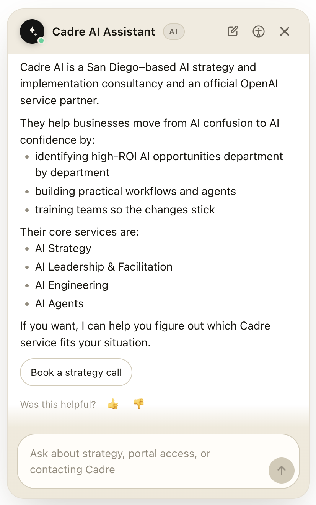
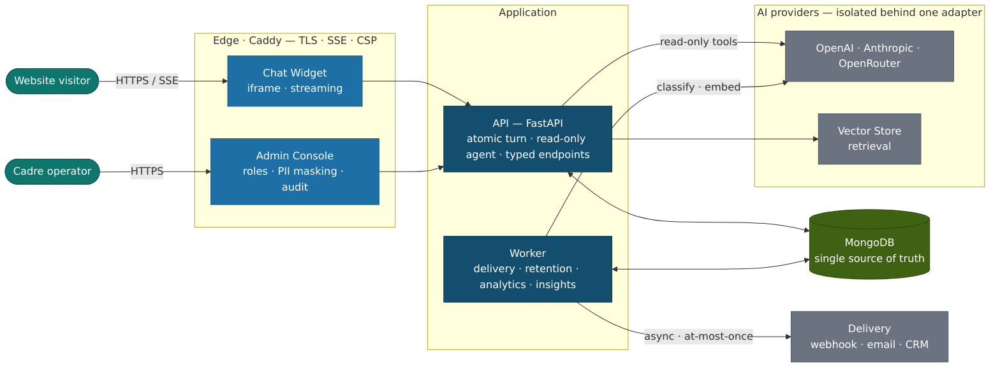
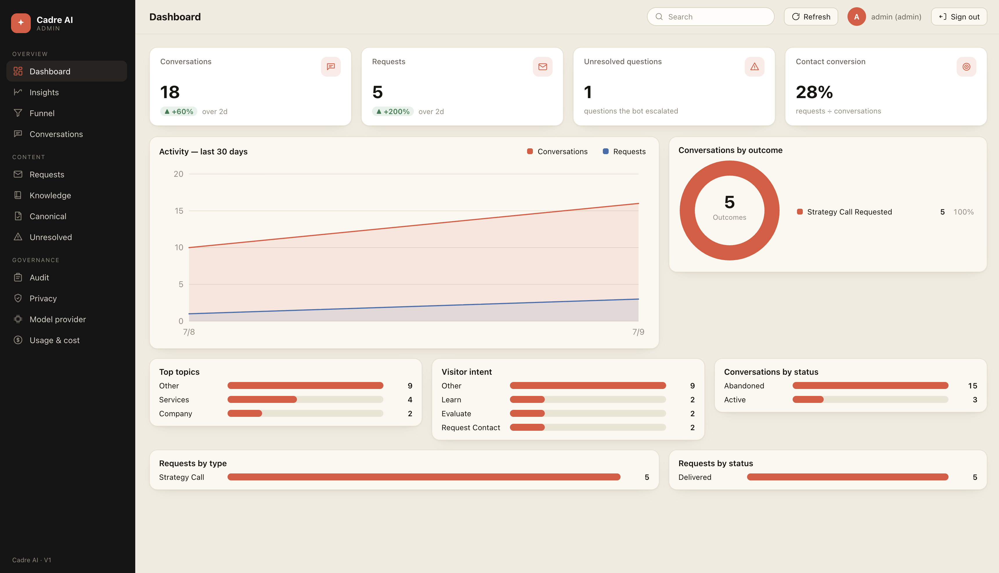
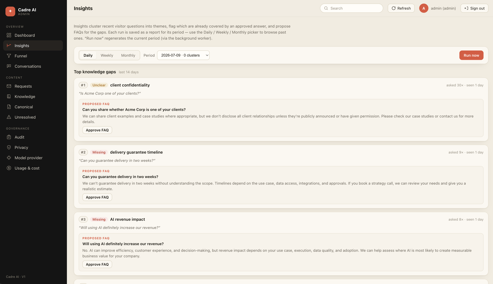

# Cadre AI — Customer Support Chatbot

A production-grade, public support chatbot for **Cadre AI**, an AI strategy &
implementation consultancy. Visitors ask about services, approach, security, and pricing in
an embedded chat widget; the bot answers **only from approved content** and — after the
visitor confirms — hands a structured request (a strategy call, portal support, or an
escalation) to the business. A role-controlled admin console gives the team the whole
picture: conversations, requests, knowledge, analytics, and privacy operations.

> **The one idea behind the whole design:** the model can *look things up, but it can never
> act.* Every side effect goes through a typed endpoint **after the visitor confirms**, and
> is delivered asynchronously by a background worker — never by the model.

<p align="center">
  
</p>

<p align="center"><em>The embedded widget streams answers token-by-token from approved
content, then offers the right next step — here, “Book a strategy call” — without ever
taking it unprompted.</em></p>

> **New here?** Start with the **[Capabilities Catalog](docs/capabilities/)** — one short
> doc per feature (what it is, why it exists, status, where it can go). This README is the
> map; the catalog is the tour.

---

## Architecture at a glance



A public **chat widget** (iframe) and an internal **admin SPA** — both React, served as static
assets by **Caddy** — talk to a **FastAPI** API. A dedicated **background worker** shares one
**MongoDB** with the API and owns everything with a side effect: request delivery, retention,
analytics, and insights. Chat runs on **OpenAI**, **Anthropic**, or **OpenRouter** — chosen at
runtime from the admin console and gated by the golden set before it can switch. Retrieval uses
an **OpenAI Vector Store**.

- **FastAPI modular monolith** + a dedicated **worker** — no Redis/broker; jobs live in MongoDB.
- **MongoDB is the single source of truth** for conversation history. Model calls are stateless:
  each turn rebuilds a windowed transcript from the conversation document and calls the provider.
- **Provider isolation** — every external system (AI providers, CRM, ticketing) hides behind one
  adapter; its types, IDs, and errors never leak out. The public API returns local IDs only.
- **Two environments** — staging and production are fully separate (Mongo, provider project,
  Vector Store). Approved content, prompts, and model config are **promoted**, never edited in
  production, and gated by a golden evaluation set.

The load-bearing rules are the **architecture invariants** in [CLAUDE.md](CLAUDE.md); the full
picture is the **[C4 architecture set](docs/architecture/)** (context → containers → components,
the data model, runtime flows, the agent, LLM usage, and the eval framework).

---

## Inside the admin console

Role-controlled, PII-masked by default, and audited on every reveal — the console turns raw
conversations into something the team can operate and improve.

<table>
<tr>
<td width="50%"></td>
<td width="50%"></td>
</tr>
<tr>
<td align="center"><em><strong>Dashboard</strong> — conversations, requests,
contact-conversion, and where conversations land, at a glance.</em></td>
<td align="center"><em><strong>Insights</strong> — visitor questions clustered into themes,
with proposed FAQs for the top knowledge gaps, approved in one click.</em></td>
</tr>
</table>

---

## Current status

| | |
|---|---|
| **Build** | **V1** (production-grade POC) + a **V1.5** feature wave — both complete |
| **Running on** | a **staging** environment (DigitalOcean droplet + DO Managed MongoDB), with **mock** request delivery |
| **Tests** | **460 backend · 87 frontend**, green |
| **Chat providers** | OpenAI (Responses API) · Anthropic (Messages API) · OpenRouter (OpenAI-compatible proxy) — switchable at runtime, gated by the golden set |
| **Production** | **not yet stood up** — gated on content sign-off, a real delivery destination, retention/legal sign-off, and infra (a domain, CDN/WAF, a pager). *These are owner/infra decisions, not remaining engineering.* |

What actually shipped, feature by feature, is in the **[Capabilities Catalog](docs/capabilities/)**.

---

## What it is

- A **public chat widget** (embedded in an iframe) that streams answers token-by-token.
- Answers come from **approved content only**: a small **canonical-answer** set wins for
  sensitive topics (pricing, security, portal, case studies), and an **OpenAI Vector Store**
  provides retrieval over an approved knowledge corpus. Anything unsupported escalates.
- The **model is read-only** — its only tools *look things up*. It never writes, sends, or
  submits. Every side effect (a strategy-call request, an escalation) happens through a typed
  application endpoint **after the visitor confirms**, delivered asynchronously by the worker.
- An **admin console** (role-controlled, PII-masked, audited) gives the team visibility:
  conversations, requests, knowledge management, analytics/insights, and privacy operations.

---

## Repository map

```
backend/            FastAPI app + worker + evaluation harness + tests
  app/
    api/            HTTP layer — public/ (widget), admin/ (console), deps, sse
    agent/          model orchestration — orchestrator, adapter, tools, prompts/
    core/           config, ids, security, masking, logging, errors
    domain/         one package per capability (canonical, knowledge, requests,
                    delivery, jobs, audit, privacy, analytics, insights, …)
    worker.py       the background worker entrypoint
  eval/             standalone golden-set evaluation tool (dev-only)
  scripts/          seed canonical answers, upload knowledge, sweep locks
frontend/           React — chat widget + admin SPA (Vite + TS)
  src/              conversation/, shell/, host/, forms/ (widget) · admin/ · api/
deploy/             docker-compose (staging/prod), Caddy, env examples
scripts/            Mongo backup / restore
docs/               planning package, capabilities catalog, C4 architecture, runbooks, knowledge corpus
```

---

## Getting started (local)

```bash
docker compose up -d mongo            # local MongoDB only

# Backend (from backend/)
uv sync
uv run uvicorn app.main:app --reload --port 8000   # API
uv run python -m app.worker                        # background worker
uv run pytest                                      # tests

# Frontend (from frontend/)
pnpm install && pnpm dev              # widget (:5273) + admin (admin.html)
```

Fuller setup, seeding, and ops are in [QUICKSTART.md](QUICKSTART.md) and the
[runbooks](docs/RUNBOOK_PROD.md). Configuration is centralized in `backend/app/core/config.py`
(pydantic-settings) — see [Configuration, prompts & environments](docs/capabilities/config-and-environments.md).

---

## Documentation map

**Start here (the shipped system):**
- **[Capabilities Catalog](docs/capabilities/)** — one doc per feature: what / why / status / future.
- **[Architecture (C4)](docs/architecture/)** — system context → containers → components, the
  data model, runtime flows, the **agent**, **LLM usage**, and the **eval framework** (Mermaid diagrams).
- [CLAUDE.md](CLAUDE.md) — the architecture invariants (the trust boundary), for anyone changing code.

**Planning package (the design):**
- [01 — Product Requirements](docs/01_Product_Requirements_Document.md) ·
  [02 — Release & Capability Plan](docs/02_Release_Capability_Plan.md) ·
  [03 — Architecture & ADRs](docs/03_Architecture_and_Decision_Records.md) ·
  [04 — API & Data Contracts](docs/04_API_and_Data_Contracts.md) ·
  [05 — Conversation & Content Spec](docs/05_Conversation_and_Content_Specification.md) ·
  [06 — Backlog & Delivery Plan](docs/06_Backlog_and_Delivery_Plan.md) ·
  [07 — V2 Authenticated Capability Plan](docs/07_V2_Authenticated_Capability_Plan.md) *(forward direction)*

**Operations & compliance:**
- [Staging deploy](docs/DEPLOY_STAGING.md) · [Production deploy](docs/DEPLOY_PROD.md) ·
  [Production runbook](docs/RUNBOOK_PROD.md) · [Privacy notice (DRAFT)](docs/PRIVACY_NOTICE.md) ·
  [Security review (V1)](docs/SECURITY_REVIEW_V1.md) ·
  [Production readiness](docs/PRODUCTION_READINESS.md)

**Quality:**
- [Evaluation tester guide](docs/EVAL_TESTER_GUIDE.md) — the golden-set gate + dev tool.

**History & decisions:**
- [V1 exit report](docs/V1_EXIT_REPORT.md) · [POC exit report](docs/POC_EXIT_REPORT.md) ·
  [Decisions log](docs/DECISIONS_LOG.md) · [archive/](docs/archive/) (POC-era guides).

---

## The trust boundary (quick reference)

These hold everywhere and are enforced in code review (full list in [CLAUDE.md](CLAUDE.md)):

1. **MongoDB is the single source of truth** for conversation history; model calls are stateless.
2. **The model is read-only** — tools only look things up; side effects go through typed endpoints after user confirmation, delivered by the worker.
3. **Provider isolation** — external types/IDs/errors never leave their adapter; the public API returns local IDs only.
4. **Canonical answers win** for sensitive topics; only *approved* content serves.
5. **No PII or message content in logs;** admin masks PII by default and audits every reveal.
