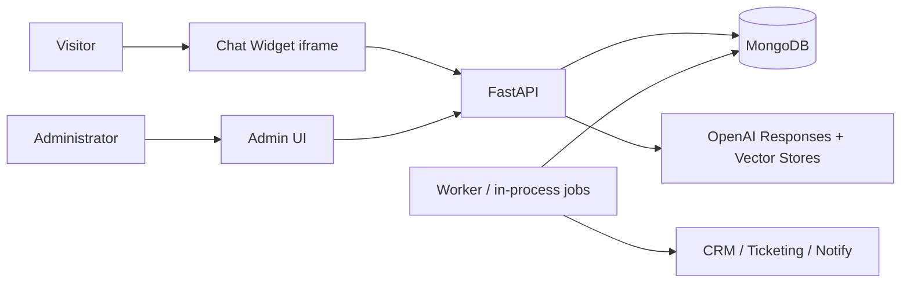

# Cadre AI Customer Support Chatbot
## Architecture and Decision Records

**Status:** Current authoritative technical design (Revision 3)
**Replaces:** Technical Design Document, System Architecture Overview, and Foundational ADRs from Revision 2

---

# 1. Design Summary

- FastAPI modular monolith on DigitalOcean; REST + Server-Sent Events.
- **MongoDB is the single system of record**, including full conversation history (messages embedded in the conversation document).
- **Stateless model calls**: each turn, the application sends the windowed transcript to the OpenAI Responses API through a thin internal adapter. No server-side provider conversation object.
- OpenAI Vector Stores for managed hybrid retrieval over approved public content.
- **Model tools are read-only** (`search_knowledge`, `get_canonical_answer`, `get_portal_information`). All side effects flow through typed application endpoints invoked directly by the browser after user confirmation — the model is not in the write path.
- One unified `requests` collection for strategy-call, portal-support, and escalation; external delivery is asynchronous and best-effort with admin visibility.
- Stateless HMAC-signed session tokens; no session collection.
- MongoDB-backed background jobs; in-process at POC, dedicated worker at V1. No Redis/broker.
- Golden evaluation set in CI as a release gate.

---

# 2. System Context and Communication Boundaries

Actors: public website visitor, Cadre administrator, external CRM/scheduler, ticketing, and notification systems, and (future) authenticated clients.



Hard boundaries:

- Browsers communicate only with Cadre APIs; never with OpenAI or MongoDB.
- The model never creates business records; only typed endpoints do, and only on explicit user action.
- External delivery happens only from background jobs, never inline in a user request after local persistence.
- Admin APIs are a separate router with separate authentication.

---

# 3. Code Architecture

```text
app/
  api/
    public/        # conversations, messages (SSE), requests, feedback
    admin/         # dashboard, conversations, requests, unresolved, knowledge (V1)
  core/            # config, errors, ids (ULID), security (HMAC tokens), logging, rate caps
  domain/
    conversations/ # service + repository (single-document operations)
    requests/      # unified request service + repository
    knowledge/     # source metadata, vector-store sync (script at POC, service at V1)
    canonical/     # canonical answer repository + matching
    feedback/
  agent/
    adapter.py     # OpenAI Responses API: send(messages, tools) -> stream; normalizes usage/errors
    prompts/       # versioned system prompt files
    tools.py       # read-only tool implementations + JSON schemas
    orchestrator.py# turn loop: lock -> build window -> call -> handle tool calls -> stream -> persist
  jobs/            # job model, atomic claim, delivery retry, retention (V1), aggregates (V1)
  eval/            # golden set loader + runner + assertions (also invoked from CI)
```

Rules:

- Routes never touch MongoDB directly; they call domain services.
- Provider-specific structures never leave `agent/adapter.py`.
- `orchestrator.py` is the only place that calls the adapter for chat.
- Everything with a side effect lives in `domain/`, guarded by validation, idempotency, and (where applicable) consent checks.

## 3.1 The turn loop (core algorithm)

```text
1. Validate session token; resolve conversation.
2. Atomically acquire the run lock and append the pending user message:
   findOneAndUpdate(
     { _id, "active_run": null,
       "messages.client_message_id": { $ne: cmid },
       message_count: { $lt: cap } },
     { $set: { active_run: {run_id, started_at} },
       $push: { messages: userMsg }, $inc: { message_count: 1 } })
   - No match + cmid exists      -> return original result (duplicate).
   - No match + active_run set   -> 409 CONVERSATION_BUSY.
   - No match + cap reached      -> RATE_LIMIT with contact alternatives.
3. Build the model window: system prompt (versioned) + last N messages
   (N sized so the full capped transcript always fits; no summarization needed at POC).
4. Call adapter.send(window, read_only_tools); execute tool calls in-process; stream deltas via SSE.
5. On completion/failure: $push assistant message (content, sources, usage, latency,
   canonical_answer_id, error_code), $set active_run: null, update last_activity_at.
6. Stale-lock sweep: any active_run older than T minutes is cleared by the next request or job.
```

One document, one lock, one write path. There is no cross-system consistency to manage.

---

# 4. Data Ownership

| Data | Authoritative system |
|---|---|
| Conversation history and transcript | MongoDB (embedded messages) |
| Business requests (call/support/escalation) | MongoDB; mirrored to CRM/tickets by delivery jobs (V1) |
| Approved searchable files | OpenAI Vector Stores |
| Knowledge governance metadata | MongoDB |
| Canonical answers | MongoDB |
| Feedback, jobs, privacy requests, eval cases | MongoDB |

OpenAI retains request data per its API data-usage terms; this is documented in the privacy notice rather than managed by a synchronization subsystem.

---

# 5. Trust Boundaries

**Public input:** length limits, validation, per-IP and per-conversation caps, sanitization, no direct data access.

**Model output:** structured tool schemas; canonical-answer precedence; the model can only read; suggested actions are IDs from an application-owned allowlist, resolved by the UI; unsupported-answer escalation is enforced by prompt and verified by the golden set.

**Retrieved knowledge:** approved-source allowlist; lifecycle state; chat content is never ingested; injection probes in the golden set include hostile retrieval content.

**Admin access:** authentication; masked PII by default; V1 adds roles, reveal-with-reason, and audit.

---

# 6. Degraded Operation

- **OpenAI unavailable:** canonical answers (served without the model where matched deterministically), portal link, and all forms keep working; generative answers show the approved limitation message.
- **Vector Store unavailable:** canonical answers and escalation remain; retrieval-limitation message shown.
- **MongoDB unavailable:** nothing is confirmed; the UI preserves drafts and shows alternate contact.
- **CRM/ticketing unavailable (V1):** invisible to the user — the request is already persisted; the delivery job retries with limits and dead-letters into the admin failure view.

---

# 7. Deployment

**POC (from week one):** one containerized FastAPI instance, one static frontend, development MongoDB (Atlas dev tier), one OpenAI project + Vector Store, HTTPS, admin behind auth, **SSE verified through the actual DigitalOcean routing path before feature work proceeds**.

**V1:** staging + production; load balancer (SSE re-verified); multiple stateless API instances as needed; dedicated worker process (same codebase, ADR-001); production MongoDB with backups/restore tests; secrets management; edge rate limits + WAF; monitoring/alerts; separate staging/production OpenAI resources.

Scaling sequence when needed: indexes → production cluster → worker → more API instances → aggregates → read optimization → queue/broker only with measured need.

---

# 8. Architecture Decision Records

Statuses: Accepted, Superseded. Superseded ADRs are retained below with links.

## ADR-001: Modular monolith — **Accepted (unchanged)**
One FastAPI codebase with typed internal module boundaries. POC: one deployable. V1: API and worker as separate processes from the same codebase. Extract services only for independent scaling, isolation, or ownership.

## ADR-002: FastAPI with REST and SSE — **Accepted (unchanged)**
SSE for streaming; WebSockets only at V2+ for live human support. New requirement: an SSE smoke test through the deployed routing path is part of Milestone 0.

## ADR-003: OpenAI Agents SDK — **Superseded by ADR-014**

## ADR-004: OpenAI Conversations as history authority — **Superseded by ADR-014**

## ADR-005: MongoDB transcript projection — **Superseded by ADR-014** (there is no projection; MongoDB is primary)

## ADR-006: MongoDB for application data — **Accepted (unchanged)**

## ADR-007: OpenAI Vector Stores for initial RAG — **Accepted (unchanged)**
POC: one dev store, default hybrid retrieval, script-based upload. V1: staging/production stores, metadata filters, thresholds, promotion. Revisit only for quality/control/cost/isolation reasons.

## ADR-008: Canonical answers for sensitive subjects — **Accepted, narrowed**
One mechanism only: the `get_canonical_answer` tool plus prompt instructions. The separate "intent pre-classification before retrieval" layer from Revision 2 is removed; precedence is enforced in the prompt and verified by the golden set. Deterministic serving without the model is used only in the OpenAI-outage degraded mode.

## ADR-009: Typed application-controlled tools — **Amended by ADR-016**
Read-only tools remain typed and validated. Side-effecting "tools" no longer exist as model tools.

## ADR-010: Eventual consistency and reconciliation — **Superseded by ADR-014** (no cross-system writes remain in the chat path). The narrower principle survives inside ADR-019 for external delivery.

## ADR-011: No Redis or broker initially — **Accepted (unchanged)**
MongoDB job documents with atomic claims (`findOneAndUpdate` on status + available_at), lock expiration, retry limits, dead-letter status.

## ADR-012: Separate public and private knowledge stores — **Accepted (unchanged; V2+ concern)**

## ADR-013: DigitalOcean hosting — **Accepted (unchanged)**

---

## ADR-014: MongoDB single source of truth; stateless model calls — **Accepted (new)**

**Context.** Revision 2 made OpenAI Conversations authoritative for history and MongoDB a projection, forcing sync states, reconciliation workers, cross-system deletion, and sync dashboards — a distributed-systems tax paid to avoid resending a few thousand tokens per turn on short, capped public chats.

**Decision.** MongoDB owns conversation history. Each turn, the orchestrator sends the system prompt plus the windowed transcript to the Responses API. No provider conversation object is created. The adapter remains the only provider-aware module, so the model provider is swappable.

Because history is app-owned and one agent with three read-only tools needs only a small loop, the Agents SDK is dropped in favor of a direct Responses API adapter (~100 lines including tool dispatch and streaming).

**Consequences.** Positive: deletes the sync/reconciliation subsystem and its collections, jobs, and admin views; single-store privacy deletion; provider-neutral from day one (a stated V2+ goal, now free); simpler mental model; trivially testable turn loop. Negative: per-turn token resend (bounded by the message cap; immaterial at public-chat lengths); prompt-cache benefits from provider-held state are forfeited; long-thread summarization becomes app responsibility if caps are ever raised.

**Revisit triggers.** Uncapped or very long threads; measured token cost materially exceeding reconciliation-subsystem cost; provider features that require server-held state and demonstrably improve quality.

## ADR-015: Embedded-message conversation documents — **Accepted (new)**

**Decision.** Messages are an array inside the conversation document, with a hard `message_count` cap (default 40) well under document-size limits. The run lock, duplicate-message check, sequencing, and cap are enforced in a single atomic `findOneAndUpdate` (Section 3.1).

**Alternatives.** Separate messages collection (needed if threads were unbounded; adds a sequence index, a lock document or field coordination, and multi-read history assembly).

**Consequences.** One write path, no distributed locking, transcript reads are one document fetch. The cap doubles as an abuse control. If V2+ removes caps for authenticated clients, tenant conversations move to a separate messages collection at that trust tier — a contained change behind the repository interface.

## ADR-016: Side effects via structured client forms, never model tool calls — **Accepted (new; amends ADR-009)**

**Decision.** The model may emit a `suggested_action` (an ID from an application allowlist). The UI renders the corresponding structured form; the user reviews, consents, and confirms; the browser calls the typed endpoint with an idempotency key. Model tools are strictly read-only.

**Consequences.** The trust boundary strengthens from "model proposes, app authorizes" to "model is not in the write path." The server-side workflow state machine, its four endpoints, draft persistence, and the `workflow_instances` collection are deleted; drafts are client-side (a lost draft on tab close is an acceptable POC/V1 trade; V1 may add localStorage-free in-memory recovery within the session). Structured forms also improve PII quality over model-extracted fields.

## ADR-017: iframe embed for the public widget — **Accepted (new)**

**Decision.** Ship the widget as an iframe loaded by a small loader script. Rationale: CSS/JS isolation from the host page, a contained origin for the session token, simpler CSP, independent deployability. Trade-off: cross-frame messaging for open/close/resize via `postMessage` with origin checks.

## ADR-018: Golden evaluation set as a release gate — **Accepted (new)**

**Decision.** 30–50 cases (happy paths, prohibited-claim probes, escalation triggers, injection probes) stored in the repository as YAML, executed by `eval/` against the live orchestrator with assertion types: `must_use_canonical`, `must_not_contain`, `must_offer_action`, `must_escalate`, `must_not_invent`. Runs in CI on every prompt, model, canonical-answer, or retrieval-configuration change. Red gate blocks release from POC onward.

## ADR-019: Unified requests with asynchronous external delivery — **Accepted (new)**

**Decision.** Strategy-call, portal-support, and escalation share one `requests` collection (type discriminator) and one submit endpoint. Submission succeeds when the record is persisted locally with a reference. External delivery (CRM/ticketing/notifications, V1) is a background job: idempotent per request, bounded retries, dead-letter status, admin failure view, ambiguity resolved by querying the external system for the request's external reference — never by user-facing retries after local persistence.

**Consequences.** User success is decoupled from third-party availability; delivery ambiguity is contained to one job; three near-identical schemas and endpoints collapse into one.

---

# 9. ADR Maintenance

When a decision changes: keep the old ADR, mark it superseded, link the replacement, record the changed assumption, and update Section 1 of this document.
