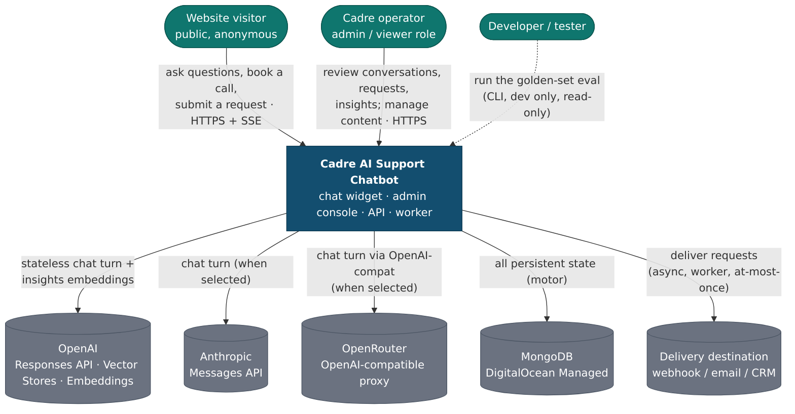

# C4 L1 — System Context

Who uses the platform, and every external system it depends on.

## Actors

| Actor | Uses | Notes |
|---|---|---|
| **Website visitor** | The chat **widget** (embedded iframe) | Public, anonymous, stateless HMAC session token. Can ask questions and — after explicit confirmation — submit a strategy-call / portal-support / escalation request. |
| **Cadre operator** | The **admin console** | Two roles: `admin` (full) and `viewer` (read-only). PII masked by default; unmasking is an audited, reason-required action. |
| **Developer / tester** | The **evaluation CLI** (`python -m eval.run`) | Dev-only tooling, run outside the app. Reads the live prompt/model/canonical and drives the golden set; never changes what ships. |

## External systems

| System | Protocol | What flows | Direction |
|---|---|---|---|
| **OpenAI — Responses API** | HTTPS (streaming) | System prompt + windowed transcript + tool specs → streamed answer/tool-calls | out/in |
| **OpenAI — Vector Stores** | HTTPS | Retrieval queries over the approved knowledge corpus (via `search_knowledge`) | out/in |
| **OpenAI — Embeddings** | HTTPS | Batched question text → vectors (insights clustering) | out/in |
| **Anthropic — Messages API** | HTTPS (streaming) | Same turn payload, provider-native shape (when the runtime provider is `anthropic`) | out/in |
| **OpenRouter** | HTTPS (streaming) | OpenAI-compatible Responses calls to Claude/others (when provider is `openrouter`); uses the OpenAI adapter with a base-URL override | out/in |
| **MongoDB (DO Managed)** | Mongo wire (`motor`) | All persistent state — 13 collections; the single source of truth for conversation history | out/in |
| **Delivery destination** | HTTPS webhook / SMTP | Normalized request payloads, delivered asynchronously by the worker (currently the `simulated` mock) | out |
| **DigitalOcean** | — | Hosting: a droplet running the Docker Compose stack; the Managed MongoDB service | — |

## Trust notes (drawn as boundaries in later levels)

- **The model is read-only.** Its only tools look things up. It never writes, sends, or delivers —
  those cross the boundary only through typed endpoints (browser, after confirmation) and the worker.
- **Provider isolation.** OpenAI/Anthropic/OpenRouter (and delivery) types, IDs, and errors never leave
  their adapter; everything downstream sees normalized types.
- **Local IDs only.** The public API returns `cnv_`/`msg_`/`req_`… ULIDs; provider file/store/message IDs
  and Mongo internals stay server-side and appear only in the audited admin.
