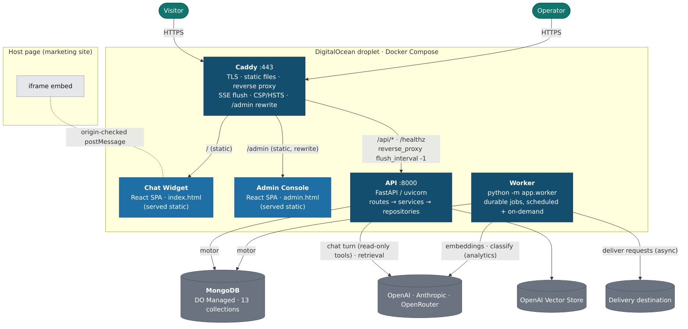

# C4 L2 — Containers

The separately-runnable units and how they connect. Everything below the internet edge runs as
Docker Compose services on one DigitalOcean droplet (staging); production scales the API behind a
load-balancing Caddy with Managed Mongo.

## Containers

| Container | Tech | Responsibility | Talks to |
|---|---|---|---|
| **Caddy** | `caddy:2` | TLS termination (auto-HTTPS), serves the static widget/admin build, reverse-proxies `/api/*` + `/healthz` to the API with **SSE-safe buffering off** (`flush_interval -1`), applies **CSP/HSTS/frame** headers, rewrites `/admin` → `admin.html`. Edge body-size cap. | Widget/Admin (static), API |
| **Chat Widget** | React + TS (Vite), served at `/` | The visitor's chat UI; runs in an **iframe**, streams answers over SSE, renders markdown, offers next-step actions and request forms. Host-page comms only via origin-checked `postMessage`. | Caddy → API |
| **Admin Console** | React + TS (Vite), served at `/admin` | Operator UI: dashboard/trends, conversations, requests, insights, funnel, knowledge, canonical, audit, privacy, monitoring, usage/cost, model-provider toggle. | Caddy → API |
| **API** | FastAPI / uvicorn, `:8000` | Stateless request handling: the atomic chat turn + SSE, the read-only model orchestration (provider-selected), typed side-effect endpoints, and the role-controlled admin API. **Routes → domain services → repositories** (routes never touch Mongo directly). | Mongo, OpenAI/Anthropic/OpenRouter, Vector Store |
| **Worker** | same image, `python -m app.worker` | Owns all side effects & background work via a durable Mongo-backed job queue: request delivery, retention/deletion, labeling, summaries, insights, aggregates, usage rollups, lock/abandonment sweeps. | Mongo, OpenAI (embeddings/classify), Delivery |
| **MongoDB** | DO Managed (dev fallback: in-stack `mongo:7`) | Single source of truth — 13 collections. Both API and Worker share it; the model is stateless per turn. | — |

## Notes

- **API is stateless** (Mongo holds all state), so production runs **≥2 API replicas** behind Caddy's
  load balancer with health-gated upstreams; the **Worker stays a single supervised instance** because
  job claims are atomic.
- **App startup** (`app/main.py` lifespan) wires shared singletons onto `app.state`: the Mongo `db`, the
  **`ProviderResolver`** (which adapter answers a turn, TTL-cached from `app_settings`), the
  `KnowledgeSearch` (Vector Store client), and the `KnowledgeStore`.
- **The eval CLI is not a deployed container** — it's dev-only tooling that drives the golden set through
  the same orchestrator + tools, outside the running stack.
- **Widget vs Admin framing:** the widget is *meant* to be embedded (no frame denial; `VITE_ALLOWED_ORIGINS`
  gates the host origins); the admin console is **`X-Frame-Options: DENY`**.
