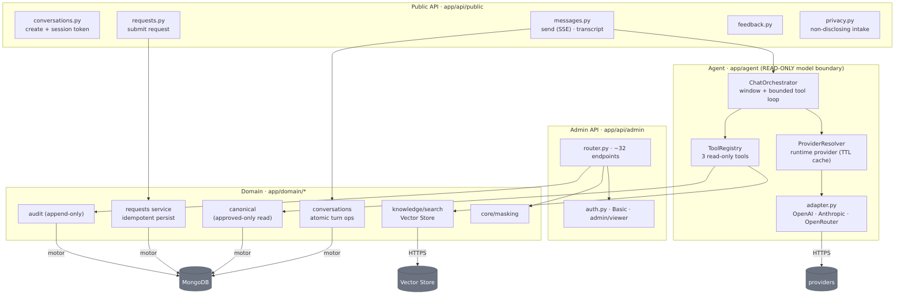
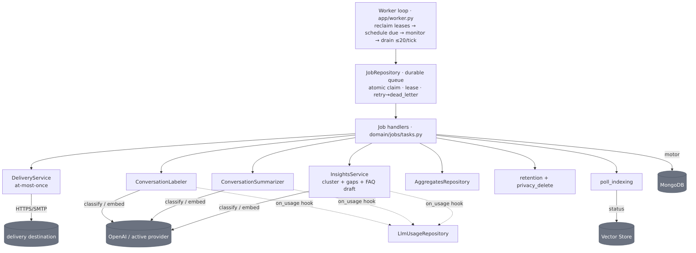

# C4 L3 — Components

The major building blocks inside the two backend containers (**API**, **Worker**) and the two
frontends. Everything follows **routes/handlers → domain services → repositories**; only repositories
touch Mongo, and only three boundary modules touch external providers.

## API container

| Component | Path | Responsibility |
|---|---|---|
| **Public endpoints** | `api/public/{conversations,messages,requests,feedback,privacy}.py` | Create conversation (+ HMAC token), the streaming send-message turn + transcript, the single side-effect endpoint (submit request), thumbs feedback, non-disclosing privacy intake |
| **Admin router** | `api/admin/router.py` | ~32 endpoints; reads mask PII by default, privileged writes require `admin` role + reason + audit |
| **Admin auth** | `api/admin/auth.py` | HTTP Basic, constant-time compare, `admin`/`viewer` roles |
| **ChatOrchestrator** | `agent/orchestrator.py` | The turn: `begin_turn` → build window → bounded model+tool loop (≤5 rounds; last round drops tools to force text) → persist assistant message → SSE frames |
| **ProviderResolver** | `agent/provider.py` | Builds one adapter per key-configured provider at startup; resolves the runtime-active one from `app_settings` (TTL-cached ~10s, fail-safe to default) |
| **Adapter (provider boundary)** | `agent/adapter.py` | The **only** caller of OpenAI Responses / Anthropic Messages; OpenRouter reuses the OpenAI adapter with a `base_url` override. Normalizes to `StreamEvent`/`Usage`/`AdapterError`; `store=False`; per-response token cap; fallback-before-first-output |
| **ToolRegistry (3 tools)** | `agent/tools.py` | The model's only tools — all read-only: `search_knowledge`, `get_canonical_answer` (approved only), `get_portal_information` |
| **KnowledgeSearch** | `domain/knowledge/search.py` | Only caller of the Vector Store search API; forces `audience=public`, clamps to 5 hits, degrades to `RETRIEVAL_UNAVAILABLE` (never raises) |
| **ConversationRepository** | `domain/conversations/repository.py` | The atomic turn (`begin_turn`: run-lock + append + dedupe + cap in one `find_one_and_update`), `complete_turn`, transcript, analytics + retention queries |
| **Core** | `core/{security,masking,net,config,errors,logging}.py` | Stateless HMAC session tokens; read-time PII masking; spoof-resistant client IP; fail-closed config; fixed error envelope; ID-only logging |

## Worker container

**The job engine:** a single supervised process. Each tick (every ~2s) it (1) reclaims lease-expired
jobs and dead-letters budget-exhausted ones, (2) enqueues due periodic jobs (deduped to at-most-one
active), (3) emits monitoring/alerts, then (4) atomically claims and dispatches up to 20 pending jobs.
A claim is one `find_one_and_update` (`pending→running`, lease). Failures **retry with capped
exponential backoff → `dead_letter`** (max 5 attempts); a hard per-job timeout (50s) sits under the
60s lease so a hung handler can never outlive its lease.

| Job (cadence) | Transformation |
|---|---|
| `deliver_request` (on-demand) | request `received→delivering→delivered`/`delivery_failed`; probes `find_by_reference` on retries; ambiguous/exhausted → parked for admin |
| `poll_indexing` (on-demand) | poll Vector Store ingestion → `knowledge_sources.indexing_status = indexed`/`failed`; re-raises retryable while `pending` |
| `label_conversations` (1h) | rules-first + one model `classify` for the residue → `conversations.labels` (topic, intent) |
| `summarize_conversations` (1h) | one model call per ended conversation → `{tldr, key_points}` digest |
| `generate_insights` (1h) | period questions → embed → cluster → per-cluster LLM analysis → `insights_reports` (+ daily auto-drafted canonical FAQ) |
| `daily_aggregates` (24h) | count snapshot (conversations/requests/feedback) → one `aggregates` doc per UTC day |
| `retention_sweep` (24h) | hard-delete past-period data per retention class (bounded batches) |
| `privacy_delete` (on-demand) | verified subject erasure → tombstone conversations, skeletonize requests, delete feedback |
| `stale_lock_sweep` (5m) · `abandonment_sweep` (1h) · `delivery_reconcile` (5m) · `privacy_reconcile` (5m) · `knowledge_review_reminder` (24h) | leaked-lock release · mark abandoned + TTL · re-enqueue/park orphaned deliveries · re-enqueue lost erasures · list sources due for review |

*Model jobs (label/summarize/insights) **never dead-letter** — a provider failure leaves the item un-annotated to retry next run. Each has a per-call timeout + a ~30s wall-clock budget that commits progress per item.*

## Frontends

| Component | Path | Responsibility |
|---|---|---|
| **Widget shell** | `frontend/src/shell/WidgetFrame.tsx` | The iframe-hosted chat panel + launcher; focus trap, Esc-close; reports footprint to the host **only** via origin-checked `postMessage` |
| **Conversation** | `frontend/src/conversation/*` | Consumes the SSE frames (renders `response.delta`, finalizes on `response.completed`), markdown rendering, suggested actions, scroll management |
| **Forms** | `frontend/src/forms/*` | The strategy-call / portal-support / escalation forms — the **only** place a side effect originates (browser POST after confirmation) |
| **Host bridge** | `frontend/src/host/messaging.ts`, `config.ts` | `postMessage` to the host page, dropping events not from an allowed origin; **throws at build time** if a prod build has unset/`*` `VITE_ALLOWED_ORIGINS` |
| **Admin SPA** | `frontend/src/admin/*` (+ `charts/`) | Dashboard/trends, conversations, requests, insights, funnel, knowledge, canonical, audit, privacy, monitoring, usage, model-provider toggle. Basic-auth client, **credentials in memory only** (never `localStorage`) |
