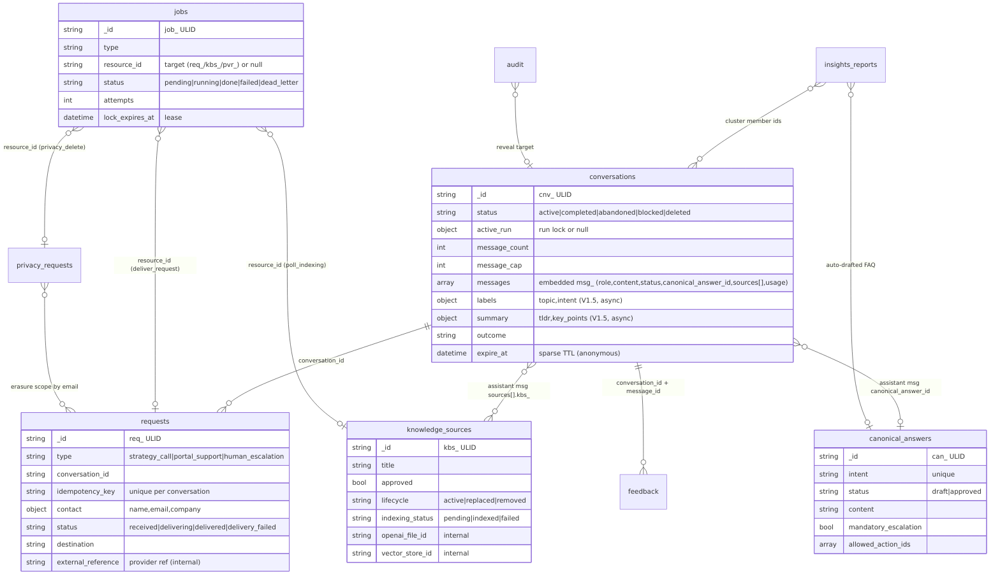

# Data Model — MongoDB (13 collections)

MongoDB is the **single source of truth**; the API and the Worker share it through the same
repositories (nothing else touches Mongo). Public/admin APIs expose only **local ULIDs**
(`cnv_`, `msg_`, `req_`, `kbs_`, `can_`, `fbk_`, `pvr_`, `job_`, `aud_`); provider IDs (OpenAI
file/vector-store IDs, external delivery references) stay **internal** and appear only in the audited
admin. Conversation history is **embedded** (messages live inside the conversation doc) so a turn —
and a deletion — is a single-document operation.

## Collections

| Collection | ID | Purpose | Key indexes / lifecycle |
|---|---|---|---|
| **conversations** | `cnv_` | The conversation + **embedded** `messages[]`, the atomic `active_run` turn lock, message cap, outcome, and (V1.5, async) `labels` + `summary`. | `{status,last_activity_at}`, `{outcome,started_at}`, `{messages.client_message_id}` sparse, **TTL on `expire_at`** (abandoned anonymous). Tombstoned on erasure. |
| **requests** | `req_` | Unified strategy-call / portal-support / escalation; persist-first, then async delivery. Holds delivery state + external reference. | `{conversation_id,idempotency_key}` **unique**, `{type,status,created_at}`, `{contact.email}`, `{external_reference}` sparse. |
| **knowledge_sources** | `kbs_` | Governance metadata for the retrieval corpus (the file bytes live in the Vector Store). Draft→approved; indexing status; review date. | `{openai_file_id}` unique sparse, `{lifecycle,category}`, `{review_date}`. |
| **canonical_answers** | `can_` | Approved, must-win answers keyed by `intent`; `draft→approved` lifecycle (only `approved` is served); mandatory-escalation + allowed actions. | `{intent,status}`. Upsert by intent. |
| **jobs** | `job_` | The durable background-job queue. Atomic claim (`pending→running`) with a lease; `attempts/max_attempts`; backoff; `dead_letter`; `last_error` is a **code only**. | `{status,available_at}`, `{lock_expires_at}`. |
| **audit** | `aud_` | **Append-only** trail of every privileged action (reveal, redeliver, approve, provider switch, verify, delete). Reason is PII-masked at rest. | Insert-only; never updated/deleted. |
| **privacy_requests** | `pvr_` | Subject access/deletion asks; `verification_status` (pending→verified/rejected, admin out-of-band) then `status` (open→completed/failed). | Guarded single-doc transitions. Deletion runs in the worker, never inline. |
| **insights_reports** | `<type>:<key>` | Dated demand-insight snapshots (`daily:2026-07-08`); question clusters, coverage, proposed FAQs, LLM narrative. Idempotent per period. | `_id` = period key (idempotent replace); `latest()` sorts by `generated_at`. |
| **aggregates** | `<date>` | Daily count snapshots (conversations/requests/feedback by status/outcome/topic/intent/type/rating) — preserves metrics before retention deletes rows. | `_id` = UTC date; counts only. |
| **app_settings** | `model_provider` | The one **runtime-mutable** setting: the active chat provider (`openai`/`anthropic`/`openrouter`) + who/when. Read by **both** API and Worker. | Single doc. |
| **llm_usage** | `<date>:<provider>:<model>:<category>` | Count-only daily LLM usage rollup ($inc upserts) written by the worker's `classify`/`embed` calls via the adapter's `on_usage` hook. | `_id` composite; $inc. |
| **rate_limits** | HMAC key | Fixed-window per-identifier counter; the key is `HMAC(identifier:window_start)` so **no raw IP** sits at rest. | **TTL on `expire_at`**. |
| **feedback** | `fbk_` | Per-message thumbs (`helpful`/`not_helpful` + reason/comment). | `{conversation_id,message_id}` unique. Cascade-deleted on erasure. |

## Notes

- **Embedded vs referenced.** Messages are embedded in `conversations`; `requests`/`feedback`/`privacy`
  reference a conversation by `conversation_id`; `jobs` reference their target by `resource_id`.
- **Derived collections** (`aggregates`, `llm_usage`, `insights_reports`) are computed by the worker from
  the primary collections — safe to rebuild, and they outlive the raw data that retention deletes.
- **Provider IDs never leak.** `openai_file_id`/`vector_store_id` (knowledge) and `external_reference`
  (delivery) are stored for the audited admin only; the public API returns local IDs.
- Full field-level contract: [doc 04 — API & Data Contracts](../04_API_and_Data_Contracts.md).
