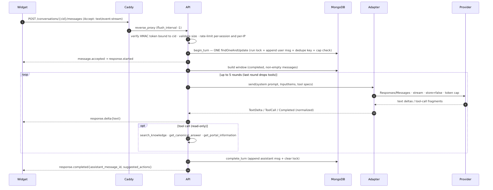
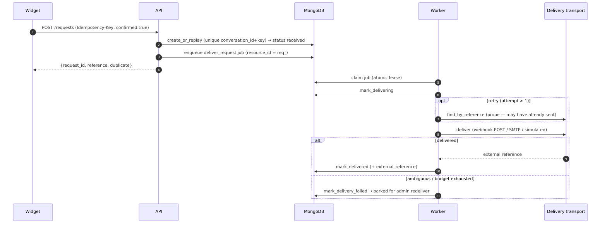
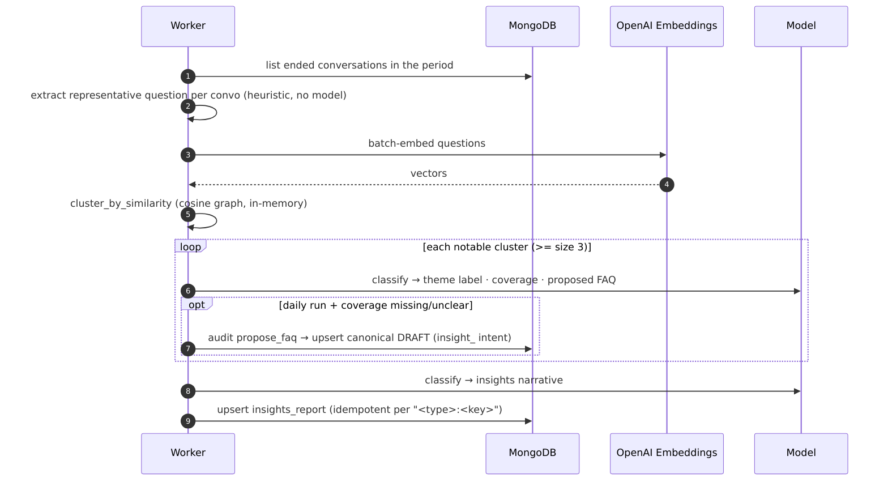
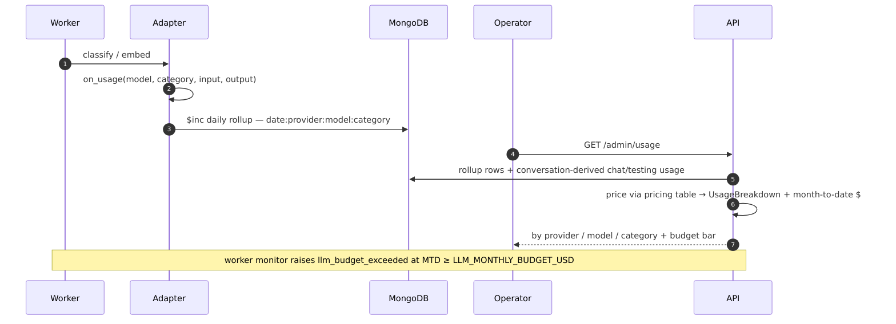
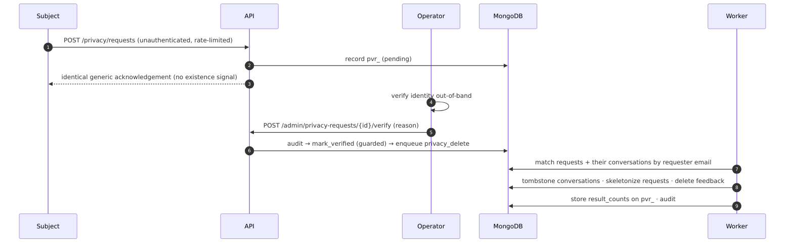
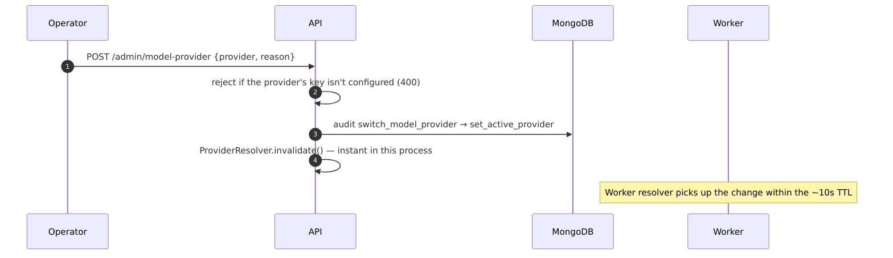

# Data Flows & Transformations

The runtime sequences that matter, with the data transformation each performs.

## 1. The chat turn (read path)

A stateless, streaming turn. The whole turn is acquired atomically, the model is called with a window
rebuilt from Mongo, and answers stream token-by-token.

**Transformation:** `conversation document` → *windowed transcript* (completed messages only) →
*provider-neutral `InputItems`* (`ModelMessage` / `AssistantToolCall` / `ToolOutput`) →
*provider request* (OpenAI input items **or** Anthropic message blocks) → *normalized `StreamEvent`s*
→ **SSE frames on the wire + one stored assistant `Message`** (with `canonical_answer_id`, deduped
`sources[]`, and `suggested_action_ids`). SSE events: `message.accepted · response.started ·
response.delta* · response.completed | response.failed | limit.reached`. Duplicate `client_message_id`
replays the stored reply; a busy conversation returns `CONVERSATION_BUSY` (409).

## 2. Request submission → async delivery (write path)

The model is **not** involved. The browser submits a confirmed form; the request is persisted first,
then delivered by the worker with at-most-once semantics.

**Transformation:** `RequestRecord` → provider-agnostic `DeliveryMessage {title, reference, fields[]}`
→ transport-serialized payload. Un-dedupable channels (webhook/SMTP) **park rather than blind-retry**
any possibly-sent request. The visitor never re-prompts; ambiguity is resolved by the job.

## 3. Insights pipeline (+ auto-drafted FAQ)

**Transformation:** `conversations` → *representative questions* → *embeddings* → *in-memory clusters*
→ *per-cluster LLM analysis* → **`insights_report`** (+ a canonical **draft** for uncovered daily
clusters, which a human must approve). The cross-report **knowledge-gap ranking** (`rank_gaps`) is a
pure read-side view over recent daily reports — no model calls, no new storage.

## 4. LLM usage → cost & budget

**Transformation:** every model call → an `on_usage` event → **count-only `llm_usage` rollup rows**;
`/admin/usage` merges those (worker categories) with per-message usage on conversations (chat/testing),
prices each via the pricing table (Anthropic authoritative; OpenAI/OpenRouter placeholders, overridable
via `LLM_PRICING`), and flags unpriced models rather than silently reporting `$0`.

## 5. Verified subject erasure

**Guarantee:** no deletes ever run on the request path; intake is non-disclosing; a verified erasure is
re-enqueued by `privacy_reconcile` if its job is lost, so it always runs.

## 6. Runtime provider switch

**Effect:** the next chat turn (API) and the next model job (Worker) resolve to the new provider's
prebuilt adapter — no redeploy. A stale/invalid selection fails **safe** to the startup-default provider.
