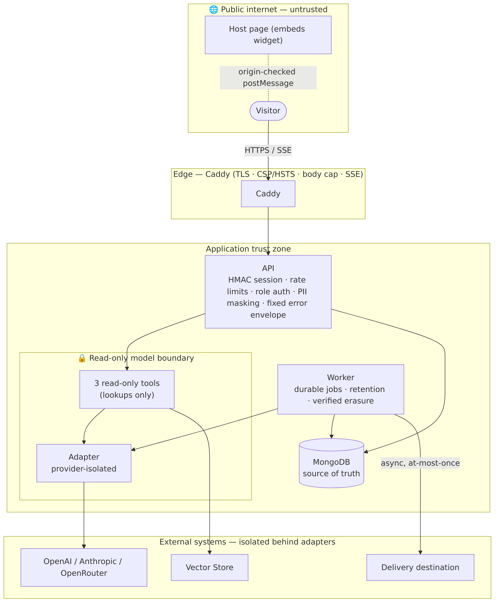

# Cross-Cutting Concerns & the Trust Boundary

The rules that hold everywhere — the security posture, the model trust boundary, provider isolation,
privacy, and how the system scales.

## 1. The read-only model boundary (the core invariant)

The model's **only** capabilities are three read-only lookups (`search_knowledge`,
`get_canonical_answer`, `get_portal_information`). It cannot write, send, or submit. Every side effect —
persisting a request, delivering it externally, deleting data, switching providers — happens **outside**
the model: through typed endpoints (browser, after explicit confirmation) and the background worker. The
orchestrator (not the model) persists the assistant message. This is what makes the public model surface
safe to expose.

## 2. Provider isolation

Three modules are the **only** places external SDKs are touched — `agent/adapter.py`
(OpenAI/Anthropic/OpenRouter), `knowledge/search.py` + `store.py` (Vector Store/Files), and
`delivery/adapters.py` (httpx/smtplib). Everything downstream sees **normalized** types
(`StreamEvent`, `SearchHit`, `DeliveryMessage`) and typed errors (`AdapterError`, `DeliveryError`).
Provider IDs/errors never escape; swapping or adding a provider is a change to one module. Model calls
are stateless (`store=False`) so Mongo stays the single source of truth.

## 3. Authentication & authorization

| Surface | Mechanism |
|---|---|
| **Visitor session** | Stateless **HMAC-SHA256** token `{cid, kid, iat, exp}` — no session collection; `kid` key-ring supports rotation; bound to the path `conversation_id`. |
| **Admin console** | HTTP **Basic**, constant-time compare, two roles: `admin` (full) and `viewer` (read-only). |
| **Privileged admin actions** | Reveal / redeliver / approve / switch-provider / verify-delete all require the **`admin` role + a reason**, and write the audit record **before** the side effect (fail-closed). |

## 4. PII & privacy

- **Masked by default.** Admin reads pass free-text through `mask_email`/`mask_company`/`mask_pii_in_text`
  at serialization time (transcripts, requests, summaries, cluster/gap questions). The verbatim value
  survives at rest; unmasking is a separate, **audited, reason-required** reveal.
- **No PII in logs.** Structured single-line JSON with IDs only; a runtime guard rejects non-static event
  strings and forbidden keys (`content/message/email/phone/token/prompt/query/…`) and keeps only exception
  *types*.
- **Verified, job-driven erasure.** Intake is unauthenticated and **non-disclosing** (identical ack for
  every input); deletion runs only after admin verification, in the worker, and tombstones/skeletonizes by
  proven email — never on the request path.
- **Retention** is enforced by a scheduled worker job per class; `aggregates` preserve counts before rows
  are deleted.

## 5. Abuse controls & rate limiting

| Control | Where |
|---|---|
| Per-session **and** per-IP fixed-window rate limits (before any paid model call) | chat turn, create-conversation, request submit, privacy intake |
| Spoof-resistant client IP (Nth-from-right `X-Forwarded-For`, `trusted_proxy_hops`) | `core/net.py` |
| Rate-limit key = `HMAC(identifier:window_start)` (no raw IP at rest) + TTL | `rate_limits` collection |
| Per-conversation **message cap** + **message length cap** | conversation model / validation |
| Per-response **output-token cap** (cost + lock-hold) | adapter |
| Edge **body-size cap** (11 MB Caddy + 10 MB app) | Caddyfile + middleware |

> Volumetric / WAF protection is a CDN-layer responsibility in production; the app controls are
> defense-in-depth behind it.

## 6. Configuration & secrets (fail-closed)

`core/config.py` is the **only** place env/`.env` is read (`pydantic-settings`). `ENV` defaults to
`prod`, and a startup validator **refuses to boot** any non-dev environment carrying a placeholder/empty/
`REPLACE_*`/localhost value for a secret or required input (session secret, admin password, OpenAI key +
Vector Store, non-localhost Mongo, https CORS), a selected-but-unconfigured provider, or a selected-but-
unconfigured delivery transport. Secrets live only in `deploy/*.env` on the host (gitignored) — never in
the repo, never in logs.

## 7. Edge & transport security

Caddy terminates TLS (auto-HTTPS) and sets **HSTS, `X-Content-Type-Options: nosniff`, Referrer-Policy,
Permissions-Policy, and a strict CSP** (`default-src 'self'; script-src 'self'; object-src 'none'; …`).
The admin console is **`X-Frame-Options: DENY`**; the widget is intentionally embeddable but only talks
to allow-listed host origins (`VITE_ALLOWED_ORIGINS`, which **throws at build time** if unset/`*` in a
prod build). SSE streams unbuffered (`flush_interval -1`).

## 8. Scaling & availability

- **API is stateless** (Mongo holds all state) → production runs **≥2 replicas** behind Caddy's
  load balancer with **health-gated round-robin** upstreams + in-request retry, so a rolling redeploy
  never surfaces a 502. SSE pins to one replica for the stream's life (fine — state is in Mongo).
- **Worker is a single supervised instance** — safe because job claims are atomic (`findOneAndUpdate`
  lease); a hung handler is bounded by a per-job timeout under the lease and reclaimed.
- **MongoDB** is a managed service in production (backups + tested restore are a launch-gate item).
- **Horizontal headroom:** add API replicas freely; the model/provider layer is per-request stateless;
  the durable job queue absorbs bursts and drains within budget.

## Trust boundaries a reviewer should verify

1. **Internet → Edge** (Caddy TLS + headers + body cap).
2. **Edge → App** (session HMAC / admin Basic + roles; rate limits; CORS).
3. **App → Model** (read-only tools; orchestrator owns writes) — the load-bearing one.
4. **App → External** (provider/delivery isolation; local IDs out, provider IDs internal).
5. **Operator → PII** (masked by default; audited, reason-required reveal).
