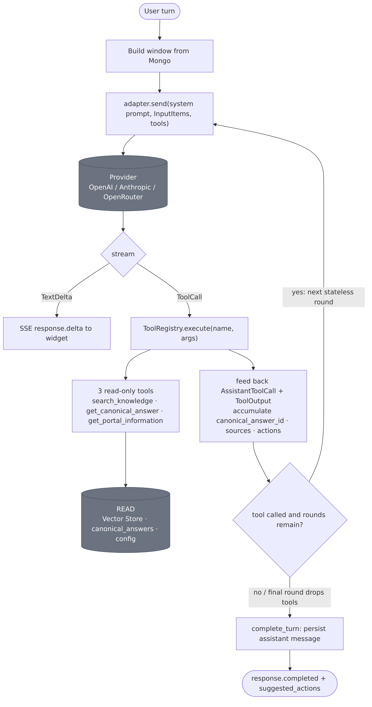
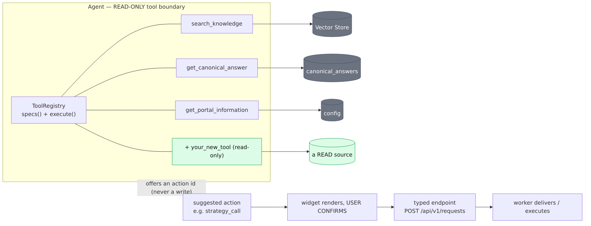

# The Agent — read-only tool loop & extensibility

The "agent" is a **bounded, single-agent, read-only tool loop**. The orchestrator runs the model in a
few rounds; in each round the model may call one of three **read-only** tools, whose results are fed
back into the next (stateless) call. Answers stream token-by-token. The model **cannot write** — every
side effect leaves the agent through the *offer-an-action* boundary. This page shows how the loop works
and, importantly, **how to add tools or richer agentic behavior** without breaking that boundary.

## The tool loop



- **Up to 5 rounds** (`_MAX_TOOL_ROUNDS`, `orchestrator.py`). Each round is its own stateless model call
  (so provider fallback is per round). On the **final permitted round the tools are dropped**, forcing
  the model to produce a text answer rather than loop forever.
- Per round: the adapter streams `TextDelta`s (→ SSE `response.delta`) and any `ToolCall`s. If the model
  called tools, the orchestrator **executes each** via the `ToolRegistry`, then appends
  `AssistantToolCall` + `ToolOutput` to the input items so the next round carries the full context. If it
  called none, the loop ends and the answer is finalized.
- Across the loop the orchestrator accumulates **out-of-band metadata** from tool results —
  `canonical_answer_id` (last wins), deduped `sources[]`, and unique `suggested_action_ids` — which it
  stores on the assistant message and uses to resolve the offered actions. **The model never mints an
  action or a source**; those come only from tool results.

## The pieces

| Piece | Path | Role |
|---|---|---|
| **ChatOrchestrator** | `agent/orchestrator.py` | Owns the turn + the ≤5-round tool loop; persists the assistant message; emits SSE frames |
| **ProviderResolver** | `agent/provider.py` | Resolves the runtime-active provider (OpenAI/Anthropic/OpenRouter) per turn |
| **ModelAdapter** | `agent/adapter.py` | Streams the model; converts `ToolSpec` → the provider's native tool format; normalizes events |
| **ToolRegistry** | `agent/tools.py` | `specs()` (what the model may call) + `execute(name, args)` (dispatch) |
| **ToolSpec** | `agent/adapter.py` | `{name, description, parameters}` — a JSON-Schema tool definition |
| **ToolExecutionResult** | `agent/tools.py` | `output` (JSON to the model) + `canonical_answer_id` / `sources` / `suggested_action_ids` (out-of-band) |
| **System prompt** | `agent/prompt.py` + `prompts/sys-v1.md` | Versioned instructions that tell the model *when* to use each tool |
| **Action resolver** | `agent/actions.py` | Maps tool-emitted action IDs → concrete offered actions (the model can't invent them) |

## The tool contract

Every tool is the same shape in and out:

```
ToolSpec(name, description, parameters: JSON-Schema)      # exposed to the model
   ──▶ model emits a ToolCall(name, arguments)
   ──▶ ToolRegistry.execute → ToolExecutionResult(
          output: JSON string,                            # returned to the model
          canonical_answer_id?, sources?, suggested_action_ids?)   # stored + resolved by the orchestrator
```

The **three tools today** are all lookups: `search_knowledge` (Vector Store), `get_canonical_answer`
(approved intents only), `get_portal_information` (portal URL + reset guidance).

---

## Extending the agent



### A. Add a read-only tool (the common case)

A new tool is a small, local change — and it's automatically exposed to **all three providers** (the
adapter maps `ToolSpec` → OpenAI function / Anthropic `input_schema`).

1. **Define a `ToolSpec`** in `agent/tools.py` — `name`, a clear `description` (this is how the model
   decides to call it), and a JSON-Schema `parameters` object.
2. **Register it:** add it to `TOOL_SPECS` and add a branch in `ToolRegistry.execute()` → a handler that
   performs the **read** and returns a `ToolExecutionResult` (JSON `output`, plus `sources` /
   `suggested_action_ids` if relevant).
3. **Wire dependencies:** if the tool needs a new repository/client, add it to `ToolRegistry.__init__`
   and construct it in `deps.py` (`get_tool_registry`).
4. **Guide the model:** add a line to the system prompt (`prompts/sys-vN.md`) saying *when* to use it.
5. **Gate it:** add a golden case in `eval/golden_set.yaml` that exercises the new routing, and run the
   eval on the target config — a prompt/tool change is a promotion, not an ad-hoc edit (invariant #15).

> **The one rule:** a tool must be **read-only** (invariant #2). It may query Mongo, the Vector Store, or
> config — it must never write, send, submit, or call an external side-effecting API.

### B. Do something (a write / "agentic action")

Writes never go through the model. When the agent should *cause* an effect (book a call, open a ticket,
escalate), it **offers an action**, not a tool call:

- A tool result carries `suggested_action_ids` (e.g. `strategy_call`, `portal_support`), resolved by
  `actions.py`. The **widget renders the action**, the **user confirms**, and a **typed endpoint**
  (`POST /api/v1/requests`) persists it; the **worker** performs the external delivery.
- This is the `requests → delivery` flow ([data flow #2](05-data-flows.md#2-request-submission--async-delivery-write-path)).
  To add a new agentic action: add an allowed action to the relevant canonical answer (or tool result),
  add the form/confirmation in the widget, and — if it's a new request type — extend the request schema +
  a delivery mapping. The model's role stays "suggest"; execution stays typed + confirmed + worker-owned.

### C. Richer / multi-step agentic workflows

The loop is deliberately simple (one agent, ≤5 rounds, read-only). To make it *more* agentic **within**
the boundary:

- **Composite read tools** — a tool that performs several reads and returns a synthesized result (e.g.
  "compare two services", "assemble an industry brief"). Cheaper and more controllable than more rounds.
- **More rounds / planning** — raise `_MAX_TOOL_ROUNDS` and/or add planning guidance to the prompt so the
  model chains lookups; the last-round-drops-tools guard still forces termination.
- **A planner/executor or sub-agents** — if a task needs real multi-step orchestration, it belongs in the
  **orchestrator layer** (or a new service the orchestrator calls), still invoking only read-only tools.
  Any step that must *write* still crosses the confirm → typed-endpoint → worker boundary. Introducing a
  second agent or a tool that itself orchestrates model calls is an **ADR-worthy** change — record it in
  [doc 03](../03_Architecture_and_Decision_Records.md), and keep provider calls inside `adapter.py`.

**What stays fixed no matter how agentic it gets:** the model is read-only; provider types stay in the
adapter; only *approved* canonical answers serve; and every write is confirmed by the user and executed
by a typed endpoint + the worker — never by the model.

## Related

- [LLM usage across the platform](08-llm-usage.md) — every place the model is called (chat vs analytics).
- [Components (L3)](03-components.md) · [Data flows](05-data-flows.md) · [Cross-cutting / trust boundary](06-cross-cutting.md).
- Invariant #2 (read-only model), ADR-016 (no side-effecting tools) — [CLAUDE.md](../../CLAUDE.md) / [doc 03](../03_Architecture_and_Decision_Records.md).
