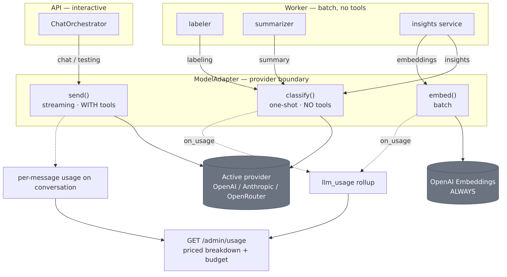

# LLM Usage Across the Platform

Where the model is actually called, and for what. There are **three call modes** through the one
provider boundary (`agent/adapter.py`) — and the model is **read-only in every one of them**.

## The three adapter methods

| Method | Shape | Tools | Used by | Provider |
|---|---|---|---|---|
| **`send()`** | streaming | **yes** (the 3 read-only tools) | the interactive chat **agent** | runtime-active (OpenAI / Anthropic / OpenRouter) |
| **`classify()`** | one-shot, non-streaming | **no** | analytics: labeling, summarization, insights analysis | runtime-active |
| **`embed()`** | batch | — | insights **clustering** | **OpenAI always** (Anthropic has none; OpenRouter is a chat proxy) |

## Every call site

| Call site | Path | Method | Category | What the model does |
|---|---|---|---|---|
| **Chat agent** | `agent/orchestrator.py` | `send` | `chat` (`testing` for eval convos) | Answer the visitor, calling read-only tools; streams tokens |
| **Topic/intent labeling** | `analytics/labeler.py` | `classify` | `labeling` | Classify the *residue* rules can't label (one call per leftover conversation) |
| **Conversation summary** | `analytics/summarizer.py` | `classify` | `summary` | Produce a `{tldr, key_points}` digest per ended conversation |
| **Insights — cluster analysis** | `insights/service.py` | `classify` | `insights` | Per notable cluster: theme label, coverage verdict, proposed FAQ |
| **Insights — narrative** | `insights/service.py` | `classify` | `insights` | The report's summary narrative |
| **Insights — clustering** | `insights/service.py` | `embed` | `embeddings` | Batch-embed representative questions → cosine clusters |

**One interactive path, several batch paths.** Only the **chat agent** is interactive, tool-using, and
provider-selectable end-to-end. Everything else is **worker-owned, tool-less, one-shot**, and produces
data a human reviews (labels/summaries are advisory; a proposed FAQ is a **draft** a human approves) —
so the model stays read-only there too.

## Two things worth calling out

1. **Embeddings are always OpenAI.** When the active chat provider is Anthropic or OpenRouter, the
   adapter still routes `embed()` to a dedicated real-OpenAI client — so an **OpenAI key stays required**
   for insights clustering regardless of which provider answers chat. (Anthropic has no embeddings API;
   OpenRouter is a chat proxy.)
2. **A provider switch moves chat *and* the analytics `classify` calls** to the new provider (both resolve
   the runtime-active adapter) — but never the embeddings. Gate any switch on the golden set first
   (invariant #15).

## Usage & cost accounting

Every `classify`/`embed` call fires the adapter's **`on_usage(model, category, input, output)`** hook →
`LlmUsageRepository` `$inc`-upserts a daily rollup row (`date:provider:model:category`). **Chat/testing**
usage is read from per-message usage stored on conversations. `GET /admin/usage` merges both, prices each
via the pricing table (Anthropic authoritative; OpenAI/OpenRouter placeholders, overridable via
`LLM_PRICING`), and shows a month-to-date budget bar; the worker raises `llm_budget_exceeded` at the
configured monthly ceiling. Full sequence: [data flow #4](05-data-flows.md#4-llm-usage--cost--budget).

## Related

- [The Agent — tool loop & extensibility](07-agent.md) — how the interactive `send()` path works and extends.
- [Analytics & insights capability](../capabilities/analytics-and-insights.md) · [Data flows](05-data-flows.md).
