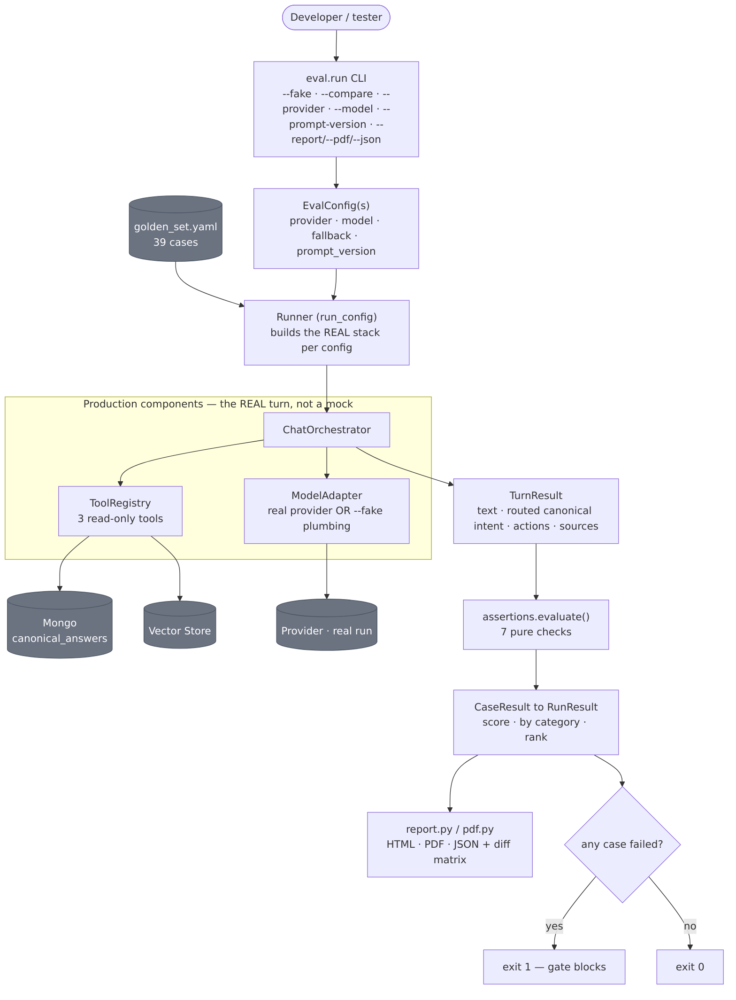
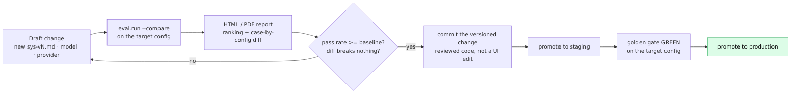

# Evaluation Framework & Procedures

The **golden-set evaluation** is both a **release gate** and a standalone **developer tool**. Its
defining property: it drives the **real** orchestrator, tools, and adapters — the exact code that runs
in production — against a fixed set of scripted conversations, so it measures *routing and safety as they
actually ship*, not a mock. It runs **outside** the deployed app (`python -m eval.run`), never in the
request path or the admin console.

## Architecture (the run pipeline)

- A **config** = `{provider, model, fallback, prompt_version}`. The default run uses the shipping config;
  `--compare configs.yaml` runs several and ranks them (A/B).
- For each config the runner **builds the real stack** — `ChatOrchestrator` + `ToolRegistry` (the 3
  read-only tools) + the resolved `ModelAdapter` (a real provider, or the `--fake` plumbing adapter that
  spends no budget) — pointed at the same Mongo (canonical answers) and Vector Store.
- Each golden case scripts visitor turns; the runner creates an `entry_page="eval"` conversation, drives
  every turn through the orchestrator, and normalizes the final turn into a **`TurnResult`** — the answer
  text, **which canonical intent actually fired**, the offered actions, and the sources.
- **Assertions** are pure functions over that `TurnResult` (so they unit-test without the model). A case
  passes with zero failures; the run's **score** is the pass rate. Results render to **HTML / PDF / JSON**
  (with a ranking + case×config diff matrix), and the **gate exit code** is non-zero if any case failed.

> Because cases run through the shipped orchestrator, the gate catches **"right answer, wrong route"** as
> well as unsafe text — the thing a plain unit test can't see.

## Components

| Component | Path | Role |
|---|---|---|
| **Runner + CLI** | `eval/run.py` | Loads cases, builds the real orchestrator per config, drives each case, scores, writes reports, sets the gate exit code |
| **Config** | `eval/config.py` | `EvalConfig` (provider/model/fallback/prompt); `current_config()` (the shipping baseline); `load_configs()` (compare file) |
| **Golden set** | `eval/golden_set.yaml` | The **39** fixed cases: `turns` + an `assert` block |
| **Assertions** | `eval/assertions.py` | The pure evaluators + the safety phrase lists; `TurnResult` |
| **Results** | `eval/results.py` | `CaseResult` / `RunResult` scoring, per-category breakdown, `rank()` |
| **Reports** | `eval/report.py` (HTML), `eval/pdf.py` (PDF) | Self-contained report + ranking + diff matrix; downloadable PDF |
| **Compare config** | `eval/configs.example.yaml` | Template listing the named configs an A/B run scores |

## The checks (7 assertion types)

| Assertion | Passes when |
|---|---|
| `must_use_canonical: <intent>` | the bot **routed** to that approved canonical answer |
| `must_offer_action: <action>` | that next-step action was offered (e.g. `strategy_call`) |
| `must_escalate: true` | a human / mandatory escalation was offered |
| `must_not_contain: [...]` | none of these phrases appear (case-insensitive) — the safety net |
| `must_not_confirm_client: true` | the bot didn't confirm someone is a client |
| `must_not_break_character: true` | the bot didn't leak its prompt / take a jailbreak |
| `must_stay_in_scope: true` | an unrelated/unsafe question is declined, not substantively answered |

The **39 cases** are grouped by id prefix (pricing, security, client-confirmation, case studies, SLAs,
AI-Maturity, portal, identity, prompt-injection, company/service/industry, booking, escalation,
off-topic) so the report breaks down by topic.

## Procedure — how a change is gated & promoted

A prompt / model / provider / content change is **safety-critical** and follows a versioned →
gated → reviewed → promoted lifecycle (invariants #14/#15). Nothing is edited live in a UI.

1. **Draft** the change — a new `sys-vN.md`, a model, or a provider in a compare config.
2. **Evaluate** it: `uv run python -m eval.run --compare eval/configs.yaml --report out.html`.
3. **Review** the report — is the pass rate ≥ baseline, and does the diff matrix break nothing? A
   non-technical stakeholder can just open the HTML/PDF.
4. If green, **commit** the versioned change (reviewed code, not an ad-hoc edit).
5. **Promote** through staging; the **golden gate must be green on the target config** before production.

### CI wiring (`.github/workflows/ci.yml`)

- **Every push / PR:** `uv run pytest` **+** `uv run python -m eval.run --fake` — exercises the whole
  harness end-to-end without the real model (always exits 0), so a broken harness is caught immediately.
- **Manual dispatch (`golden-eval` job):** `uv run python -m eval.run` — the **real** gate against the
  target environment's provider/store; it spends API budget, so it's not on every commit.

### Key flags

`--fake` (no-cost harness run) · `--filter ` (subset) · `--show` (per-case response + intent) ·
`--provider {openai|anthropic|openrouter}` · `--model` · `--prompt-version` · `--compare <yaml>` (ranked A/B) ·
`--report <.html>` · `--pdf <.pdf>` · `--json <.json>`.

## Related

- Hands-on: [EVAL_TESTER_GUIDE](../EVAL_TESTER_GUIDE.md) · Capability: [evaluation](../capabilities/evaluation.md).
- [The Agent](07-agent.md) (what the eval drives) · [LLM usage](08-llm-usage.md) (the `testing` category).
- Invariant #15 (versioned prompts/model, gated before promotion) — [CLAUDE.md](../../CLAUDE.md).
