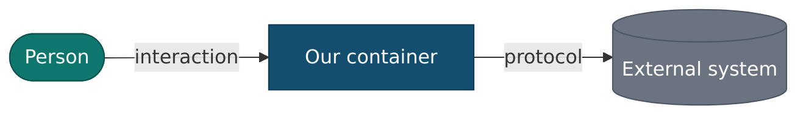

# Architecture — Cadre AI Support Chatbot

A **C4-style** architecture reference for the platform as it runs today (V1 + V1.5 + the
hardening/multi-provider wave). Diagrams are Mermaid so they render on GitHub.

> The [C4 model](https://c4model.com) describes software at four zoom levels — **Context**
> (the system + its users + external systems), **Containers** (the separately-deployable/runnable
> units), **Components** (the major building blocks inside a container), and **Code**. This set
> covers levels 1–3 plus the data model and the runtime data flows; code-level detail lives in the
> [capability docs](../capabilities/) and the source.

## The documents

| # | Doc | C4 level | What it answers |
|---|---|---|---|
| 1 | [System Context](01-context.md) | L1 | Who uses it, and every external system it depends on |
| 2 | [Containers](02-containers.md) | L2 | The runnable units (widget, admin, API, worker, Caddy, Mongo) + how they connect |
| 3 | [Components](03-components.md) | L3 | The major building blocks inside the API and the Worker |
| 4 | [Data Model](04-data-model.md) | — | The 13 MongoDB collections, their shapes, and relationships |
| 5 | [Data Flows](05-data-flows.md) | — | The key runtime sequences + data transformations |
| 6 | [Cross-Cutting & Trust Boundary](06-cross-cutting.md) | — | Security, provider isolation, PII, scaling |
| 7 | [The Agent](07-agent.md) | focus | The read-only tool loop, the tool contract, and **how to add tools / more agentic workflows** |
| 8 | [LLM Usage](08-llm-usage.md) | focus | Every place the model is called (chat vs. labeling / summary / insights / embeddings) + cost |
| 9 | [Evaluation Framework](09-evaluation.md) | focus | The golden-set gate architecture (drives the *real* stack), the assertion checks, and the promotion procedure |

## The platform in one paragraph

A public **chat widget** (embedded via iframe) and an internal **admin SPA** — both React, served as
static assets by **Caddy** — talk to a **FastAPI** API. A dedicated **background worker** shares one
**MongoDB** with the API (13 collections; Mongo is the single source of truth for conversation history).
The **model is read-only**: its only tools *look things up* (knowledge search, canonical answers, portal
info); every side effect (a strategy-call request, an escalation, a delivery, a deletion) happens through
typed endpoints and the worker, never through the model. Chat can run on **OpenAI** (Responses API),
**Anthropic** (Messages API), or **OpenRouter** (an OpenAI-compatible proxy), chosen at runtime from the
admin console; retrieval uses an **OpenAI Vector Store**, and insights embeddings always use **OpenAI**.

## Diagram legend



- **Teal** = a person (actor). **Blue** = something we build/run. **Grey** = an external system.
- A dashed boundary marks a **trust boundary** (e.g. the public internet edge, or the read-only model boundary).

## Diagrams

Each diagram is a rendered **PNG** in [`diagrams/`](diagrams/), generated from its Mermaid source
(`diagrams/<name>.mmd`) so it displays in any Markdown viewer (not only GitHub's Mermaid renderer). To
regenerate after editing a source file:

```bash
docker run --rm -u "$(id -u):$(id -g)" -v "$PWD/docs/architecture/diagrams:/data" \
  minlag/mermaid-cli -i /data/<name>.mmd -o /data/<name>.png -s 2 -b white
```

> Sequence-diagram message text must avoid `;` and `<br/>` — Mermaid treats them as separators.

## Related

- Per-feature detail: [capabilities catalog](../capabilities/) · Design rationale/ADRs:
  [doc 03](../03_Architecture_and_Decision_Records.md) · API/data contracts:
  [doc 04](../04_API_and_Data_Contracts.md) · Invariants: [CLAUDE.md](../../CLAUDE.md).
